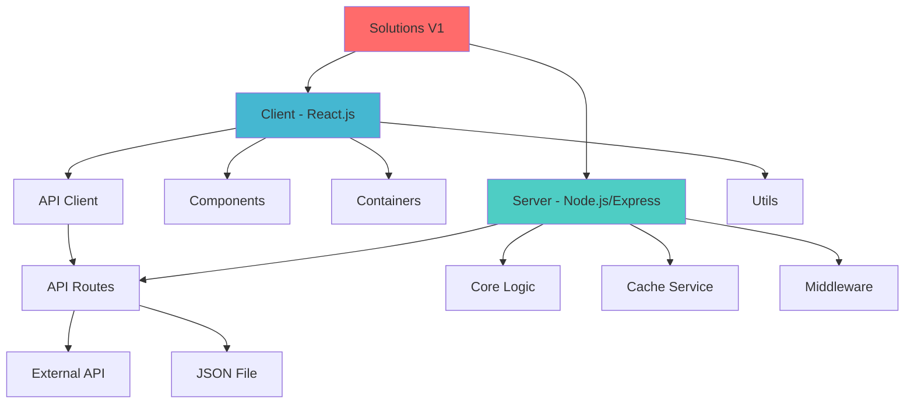
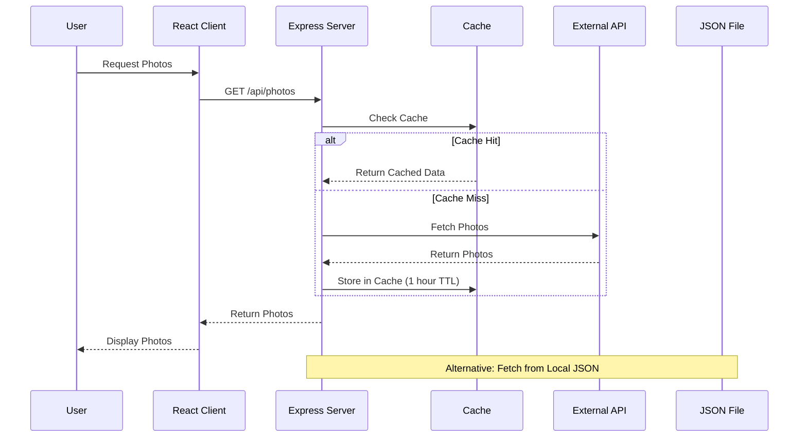
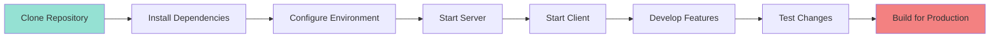

# Solutions V1

A full-stack web application template demonstrating REST API architecture with React.js frontend and Node.js/Express backend.

Built in November 2018. This project serves as a learning template for building modern web applications with a simple API that fetches and displays photo data from external sources.

## Features

- 🚀 Express.js REST API server with environment-based configuration
- ⚛️ React.js single-page application with local state management
- 📦 In-memory caching for improved performance
- 🔄 Data fetching from external APIs and local JSON files
- 🌐 CORS support for cross-origin requests
- 📝 Winston-based logging system
- 🎨 Modern, responsive UI components
- 🧭 React Router for navigation
- 🔐 Authentication component structure

## Getting Started

### Prerequisites

- Node.js (v8.11.3 or higher)
- npm (v6.1.0 or higher) or yarn
- Git

### Installation

1. Clone the repository:
```bash
git clone https://github.com/orassayag/solutions-v1.git
cd solutions-v1
```

2. Install server dependencies:
```bash
cd server-node
npm install
```

3. Install client dependencies:
```bash
cd ../client-react-local-state
npm install
```

### Running the Application

#### Start the Server

```bash
cd server-node
npm start
```

Server runs on http://localhost:3001 by default.

#### Start the Client

```bash
cd client-react-local-state
npm start
```

Client runs on http://localhost:3000 and automatically opens in your browser.

## Project Structure



## Architecture



## Available Scripts

### Server (server-node)

- `npm start` - Start the server in the current environment

### Client (client-react-local-state)

- `npm start` - Start development server with hot reload
- `npm build` - Build optimized production bundle
- `npm test` - Run test suite

## API Endpoints

### GET /api/photos

Fetches photos from external API or local JSON file.

**Query Parameters:**
- `count` (optional) - Number of photos to return

**Examples:**
```bash
# Get all photos
curl http://localhost:3001/api/photos

# Get first 10 photos
curl http://localhost:3001/api/photos?count=10
```

**Response:**
```json
[
  {
    "albumId": 1,
    "id": 1,
    "title": "Photo Title",
    "url": "https://example.com/photo.jpg",
    "thumbnailUrl": "https://example.com/thumbnail.jpg"
  }
]
```

## Configuration

### Server Configuration

Edit files in `server-node/config/`:
- `config.development.json` - Development settings
- `config.production.json` - Production settings
- `config.test.json` - Test settings

```json
{
  "PORT": 3001,
  "URL": "https://jsonplaceholder.typicode.com/photos"
}
```

### Client Configuration

Edit files in `client-react-local-state/src/settings/`:
- `settings.development.json` - Development settings
- `settings.production.json` - Production settings

## Technologies Used

### Backend
- **Node.js** - JavaScript runtime
- **Express.js** - Web application framework
- **Axios** - HTTP client for API requests
- **node-cache** - In-memory caching
- **Winston** - Logging library
- **CORS** - Cross-origin resource sharing

### Frontend
- **React.js** - UI library
- **React Router** - Client-side routing
- **Axios** - HTTP client
- **Webpack** - Module bundler
- **Babel** - JavaScript compiler
- **Jest** - Testing framework

## Development Workflow



## Caching Strategy

The server implements a caching layer with a 1-hour TTL (Time To Live):
- First request fetches from external API
- Subsequent requests serve from cache
- Cache automatically expires after 1 hour
- Improves performance and reduces API calls

## Error Handling

- Centralized error handling middleware
- Winston logging for server errors
- User-friendly error messages
- Detailed error logging in development mode

## Contributing

Contributions to this project are [released](https://help.github.com/articles/github-terms-of-service/#6-contributions-under-repository-license) to the public under the [project's open source license](LICENSE).

Everyone is welcome to contribute. Contributing doesn't just mean submitting pull requests—there are many different ways to get involved, including answering questions and reporting issues.

Please read [CONTRIBUTING.md](CONTRIBUTING.md) for details on our code of conduct and the process for submitting pull requests.

## Versioning

We use [SemVer](http://semver.org/) for versioning. For the versions available, see the [tags on this repository](https://github.com/orassayag/solutions-v1/tags).

## Author

* **Or Assayag** - *Initial work* - [orassayag](https://github.com/orassayag)
* Or Assayag <orassayag@gmail.com>
* GitHub: https://github.com/orassayag
* StackOverflow: https://stackoverflow.com/users/4442606/or-assayag?tab=profile
* LinkedIn: https://linkedin.com/in/orassayag

## License

This application has an MIT license - see the [LICENSE](LICENSE) file for details.
